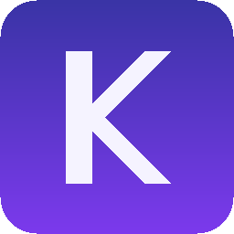

<p align="center">
  
</p>

# Koras.AI

**One AI client for .NET — chat, streaming, structured output, tool calling, and embeddings across OpenAI, Azure OpenAI, Anthropic, Google Gemini, and Ollama, with resilience and observability built in.**

[](https://github.com/korastechnologies/koras-ai-sdk/actions/workflows/build.yml)
[](https://github.com/korastechnologies/koras-ai-sdk/actions/workflows/test.yml)
[](https://www.nuget.org/packages/Koras.AI)
[](https://www.nuget.org/packages/Koras.AI)
[](LICENSE)

Supports **.NET 8, .NET 9, and .NET 10**.

## Why Koras.AI

Every provider has its own SDK, its own models, its own streaming format, and its own error
semantics. Koras.AI gives you **one strongly typed API** — switch providers with configuration,
not a refactor:

- 💬 **Chat + streaming** — `CompleteAsync` / `await foreach (… in StreamAsync(…))`
- 📦 **Structured output** — `CompleteAsync<Invoice>(…)` with JSON-schema generation from your types
- 🔧 **Tool calling** — declare tools from C# delegates; an optional bounded loop runs them automatically
- 🧭 **Embeddings** — one `IEmbeddingClient` across providers
- ♻️ **Resilience** — bounded retry with jitter + `Retry-After`, per-attempt timeouts, provider **fallback chains**
- 🚨 **Normalized errors** — one `AiException` with a documented `AiErrorCode` for every provider
- 📊 **Observability** — `ILogger`, `ActivitySource`, and `Meter` following the OpenTelemetry GenAI conventions; health checks
- 🪶 **Light by design** — providers speak REST directly; no vendor SDKs in your dependency graph

## Installation

```bash
dotnet add package Koras.AI                # core (includes DI)
dotnet add package Koras.AI.OpenAI         # + any providers you use:
dotnet add package Koras.AI.AzureOpenAI
dotnet add package Koras.AI.Anthropic
dotnet add package Koras.AI.Gemini
dotnet add package Koras.AI.Ollama
dotnet add package Koras.AI.AspNetCore     # health checks (optional)
dotnet add package Koras.AI.OpenTelemetry  # OTel wiring (optional)
```

Libraries that just need "any chat model" reference only `Koras.AI.Abstractions`.

## Five-minute quick start

No API key needed — start with [Ollama](https://ollama.com) locally (`ollama pull llama3.2`):

```csharp
using Koras.AI;
using Microsoft.Extensions.DependencyInjection;

var services = new ServiceCollection();
services.AddKorasAI(ai =>
{
    ai.AddOllama(o => o.DefaultModel = "llama3.2");
    ai.UseRetry();
});

var chat = services.BuildServiceProvider().GetRequiredService<IChatClient>();

// Chat
var reply = await chat.CompleteAsync("Explain dependency injection in one sentence.");
Console.WriteLine(reply.Text);

// Streaming
await foreach (var update in chat.StreamAsync(ChatRequest.FromPrompt("Count to five.")))
    Console.Write(update.TextDelta);
```

Switching to a hosted provider is configuration, not code:

```csharp
services.AddKorasAI(ai => ai.AddOpenAI(o =>
{
    o.ApiKey = configuration["OpenAI:ApiKey"];   // user secrets / env vars — never source code
    o.DefaultModel = "gpt-4o-mini";
}));
```

## ASP.NET Core

```csharp
builder.Services.AddKorasAI(ai =>
{
    ai.AddAzureOpenAI(builder.Configuration.GetSection("Koras:AI:AzureOpenAI"));
    ai.AddAnthropic(builder.Configuration.GetSection("Koras:AI:Anthropic"));
    ai.AddFallback("resilient", "azure_openai", "anthropic").AsDefault();  // automatic failover
    ai.UseRetry();
});
builder.Services.AddHealthChecks().AddKorasAI();
builder.Services.AddOpenTelemetry()
    .WithTracing(t => t.AddKorasAI())
    .WithMetrics(m => m.AddKorasAI());
```

```json
// appsettings.json — keys come from user secrets or environment variables
{
  "Koras": { "AI": {
    "AzureOpenAI": { "Endpoint": "https://my-resource.openai.azure.com", "Deployment": "gpt-4o-mini" },
    "Anthropic":   { "DefaultModel": "claude-sonnet-4-5" }
  } }
}
```

## Structured output & tools

```csharp
record Invoice(string Number, decimal Total, DateOnly? DueDate);

var invoice = await chat.CompleteAsync<Invoice>($"Extract the invoice data:\n{email}");
Console.WriteLine(invoice.Value.Total);

var weather = AiTool.Create("get_weather", "Gets current weather",
    ([Description("City name")] string city) => WeatherService.Lookup(city));

var answer = await chat.CompleteAsync(new ChatRequest
{
    Messages = [ChatMessage.User("Should I bike to work in Oslo today?")],
    Options = new ChatOptions { Tools = [weather] },
});  // with ai.UseToolInvocation(), the tool runs automatically
```

## Error handling — one taxonomy for every provider

```csharp
try { await chat.CompleteAsync(prompt, ct); }
catch (AiException ex) when (ex.Code == AiErrorCode.RateLimited)
{
    logger.LogWarning("Throttled; retry after {Delay}", ex.RetryAfter);
}
catch (AiException ex) when (ex.Code == AiErrorCode.ContentFiltered) { /* … */ }
```

## Packages & architecture

| Package | Purpose |
|---|---|
| `Koras.AI.Abstractions` | Contracts and models — safe for libraries |
| `Koras.AI` | Core: DI builder, retry, fallback, tool loop, structured output, templates, telemetry |
| `Koras.AI.{OpenAI, AzureOpenAI, Anthropic, Gemini, Ollama}` | One focused adapter per provider |
| `Koras.AI.AspNetCore` | Health checks |
| `Koras.AI.OpenTelemetry` | One-line OTel registration |

Architecture details: [docs/architecture/overview.md](docs/architecture/overview.md).

## Documentation & samples

- 📚 **[Documentation home](docs/index.md)** — getting started, concepts, feature guides, recipes, troubleshooting
- 🧪 **Samples:** [Console](samples/Console.Sample) · [Web API](samples/WebApi.Sample) · [Minimal API](samples/MinimalApi.Sample) · [Worker Service](samples/WorkerService.Sample)

## Security & quality

Secure by default: keys only via configuration, header-based auth, HTTPS-enforced endpoints,
no prompt/response content in logs or traces unless explicitly opted in, bounded retries and
tool loops, pinned dependencies with NuGet audit failing the build on known vulnerabilities.
See the [threat model](docs/security/threat-model.md) and [SECURITY.md](SECURITY.md).

Quality gates: 400+ tests across net8/net9/net10 (unit, provider contract, architecture,
end-to-end against in-process fake provider servers), public-API snapshot gate, deterministic
builds with SourceLink, CodeQL, and dependency review. Performance notes:
[docs/performance](docs/performance/performance-guide.md).

## Versioning & support

[SemVer](docs/release/versioning.md); currently **0.1.0-preview.1** — the API may change until
0.5.0 (freeze candidate). Backward-compatibility promise begins at 1.0.0
([policy](docs/api/backward-compatibility.md)). Questions → [SUPPORT.md](SUPPORT.md).

## Contributing

Contributions welcome — provider adapters are the ideal shape. Start with
[CONTRIBUTING.md](CONTRIBUTING.md) and the [good-first tiers](CONTRIBUTING.md#good-first-contributions).

## License

[MIT](LICENSE) © Koras Technologies
