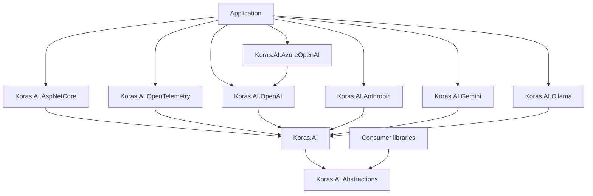
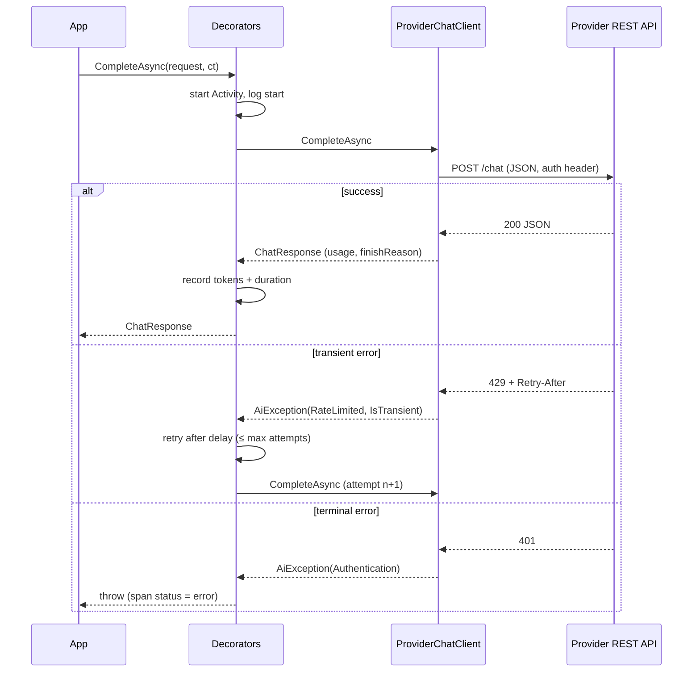
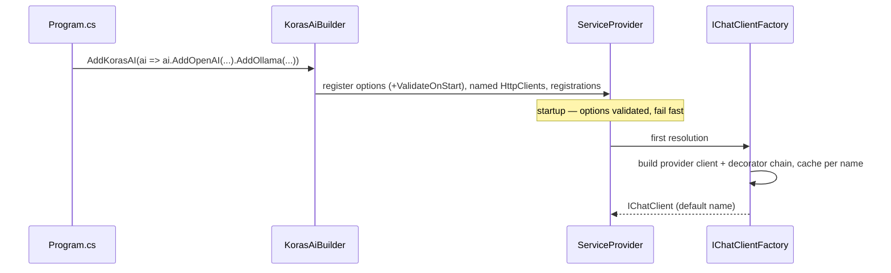
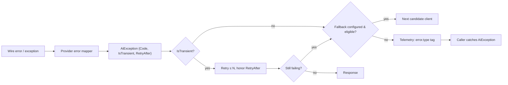
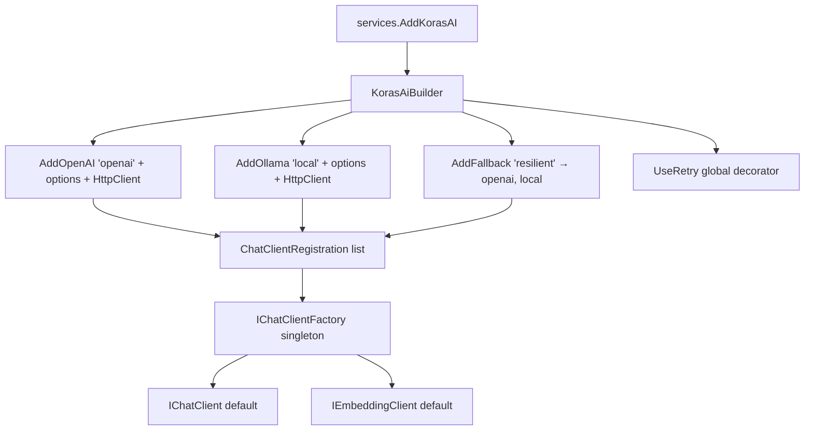
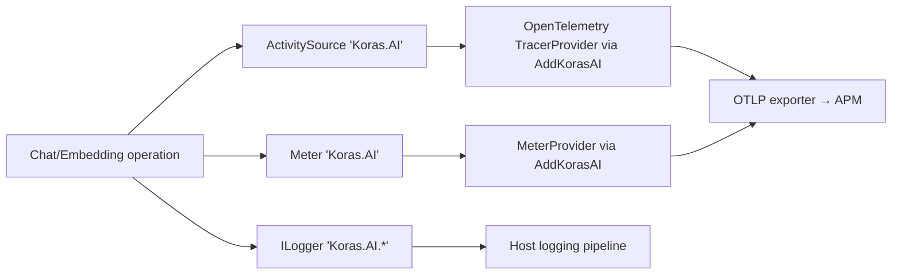

# Architecture Diagrams

## Package dependency diagram

## Component architecture

```mermaid
graph LR
    subgraph Koras.AI
        B[KorasAiBuilder / AddKorasAI] --> F[IChatClientFactory]
        F --> D1[TelemetryChatClient]
        D1 --> D2[LoggingChatClient]
        D2 --> D3[ToolInvokingChatClient*]
        D3 --> D4[RetryChatClient]
        D4 --> D5[FallbackChatClient*]
    end
    D5 --> P[Provider client &#40;IChatClient&#41;]
    P --> H[HttpClient via IHttpClientFactory]
    style D3 stroke-dasharray: 5 5
    style D5 stroke-dasharray: 5 5
```

\* dashed decorators are opt-in.

## Request lifecycle (chat)

## Provider lifecycle (registration → resolution)

## Error lifecycle

## Dependency-injection flow

## Telemetry flow

