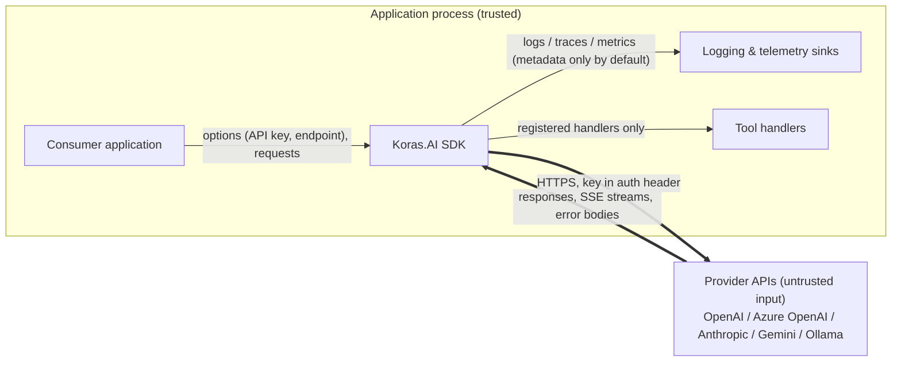

# Threat Model

This document describes what the Koras.AI SDK protects, where the trust boundaries are, and
how the identified threats are mitigated. It complements the [security policy](../../SECURITY.md)
and the [error model](../architecture/error-model.md).

## Assets

| Asset | Why it matters |
|---|---|
| Provider API keys | Full-spend credentials for the configured AI provider account. |
| Prompt and response content | Frequently contains personal, confidential, or regulated data. |
| Availability | The SDK sits on hot request paths; unbounded retries or loops become self-inflicted DoS. |
| Supply chain | The SDK is a library — a compromised dependency compromises every consumer. |

## Trust boundaries

Everything that crosses the SDK ↔ provider boundary is treated as untrusted input: success
payloads, stream events, and error bodies are parsed defensively and normalized into
`AiException` (see `src/Koras.AI/Providers/ProviderErrors.cs`).

## Threats and mitigations (STRIDE-style)

| Threat | Category | Mitigations | Residual risk |
|---|---|---|---|
| API key leakage via logs, exceptions, or telemetry | Information disclosure | Keys accepted only through options types, sent only in auth headers (`Authorization: Bearer`, `api-key`, `x-api-key`, `x-goog-api-key`) — never query strings. Provider error bodies are truncated to 4 KB and scrubbed before being attached to `AiException.ProviderErrorBody`; log messages carry code/status/RequestId, never keys. | A consumer's own exception handler could log an options object; keep secrets out of `ToString()` paths. |
| SSRF via endpoint override | Tampering / elevation | Endpoints come only from explicit configuration — there is no request-time endpoint parameter. Startup validation (`ValidateOnStart`) rejects non-HTTPS endpoints except loopback. | If an application forwards **user-supplied** endpoint values into options, the SDK cannot distinguish them from operator configuration. **Don't do this.** Treat endpoints as deploy-time configuration only. |
| Prompt injection driving tool execution | Elevation of privilege | Tool handlers execute only when explicitly registered via `AiTool.Create`; the model cannot name arbitrary code. Tool arguments are bound and validated against the generated JSON schema. The tool loop is bounded by `ToolInvocationOptions.MaxIterations` (default 8). | The SDK cannot know whether a tool *action* is authorized. Tool authors must perform their own authorization inside handlers and treat model-provided arguments as untrusted input. |
| Malicious/malformed provider payloads (deserialization) | Tampering | System.Text.Json with safe defaults: no polymorphic type resolution driven by payload data, no dynamic type loading; unparseable payloads become `AiErrorCode.InvalidResponse`. | None known beyond STJ itself (patched via NuGetAudit, below). |
| DoS via unbounded retries / retry storms | Denial of service | Retries are bounded (default 3 attempts total), exponential backoff with full jitter, capped delay (30 s), per-attempt timeout (100 s), and provider `Retry-After` hints honored. Only `IsTransient` errors retry; streaming retries stop after the first emitted update. | Aggregate load across many instances is a capacity-planning concern for the consumer. |
| DoS via runaway tool loop | Denial of service | Loop bounded by `MaxIterations` (8); exceeding it throws rather than spinning. | — |
| Dependency compromise | Supply chain | Central Package Management pins every version (no floating versions); `NuGetAudit`/`NuGetAuditMode=all` fails builds on known advisories; `dotnet list package --vulnerable --include-transitive` gates CI; Dependabot + dependency-review action with a license allowlist; CodeQL on every PR. See [dependency security](dependency-security.md). | A zero-day in a pinned dependency before an advisory exists. |
| Repudiation / missing audit trail | Repudiation | Every operation logs provider, model, duration, tokens, and the provider `RequestId`; spans carry `error.type`. | — |

## Explicitly out of scope

- **Model behavior** — jailbreaks, hallucination, and prompt-injection resistance of the models
  themselves are the provider's domain. SDK behaviors that would *worsen* injection (e.g.,
  executing undeclared tools) are in scope and treated as vulnerabilities.
- **Provider-side security** — storage, retention, and access control at OpenAI, Azure,
  Anthropic, Google, or a local Ollama host. See [data protection](data-protection.md).

## Reporting

Suspected gaps in any mitigation above are vulnerabilities — report them privately per
[SECURITY.md](../../SECURITY.md).
